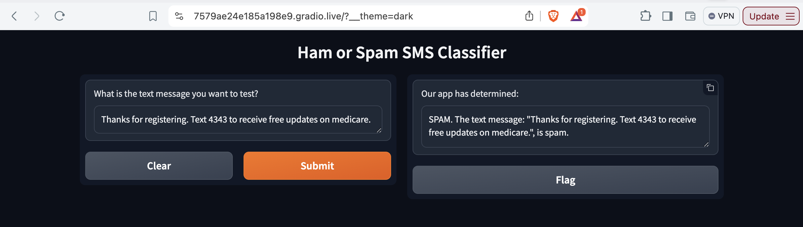

# Module 21 Challenge

Public URL will expire after 72 hours. Run the cell that contains the following code to regenerate a public URL:

``` app.launch(share=True) ```


To get dark_mode (as in the [challenge instructions](https://bootcampspot.instructure.com/courses/5440/assignments/76401?module_item_id=1225855)), add "?__theme=dark" to the public URL.

Here is the [active gradio URL, created on 16 August at 11:32 am Eastern time:](https://61438d87a4d159dd08.gradio.live?__theme=dark)

```
Running on public URL: https://61438d87a4d159dd08.gradio.live?__theme=dark
```

Screenshot of working gradio UI with dark theme:
